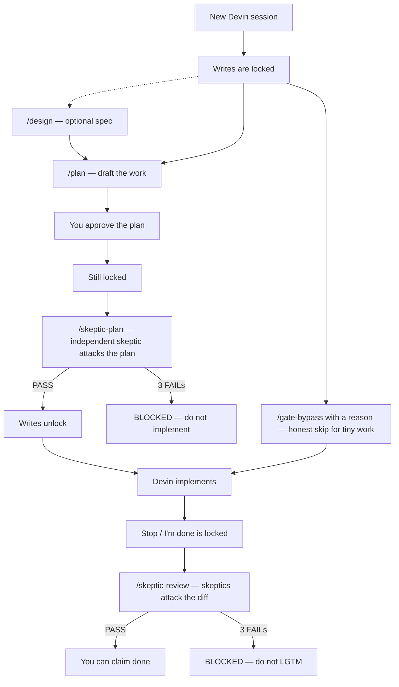
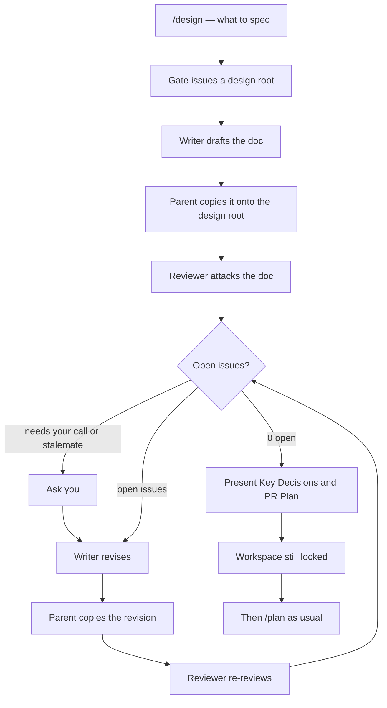
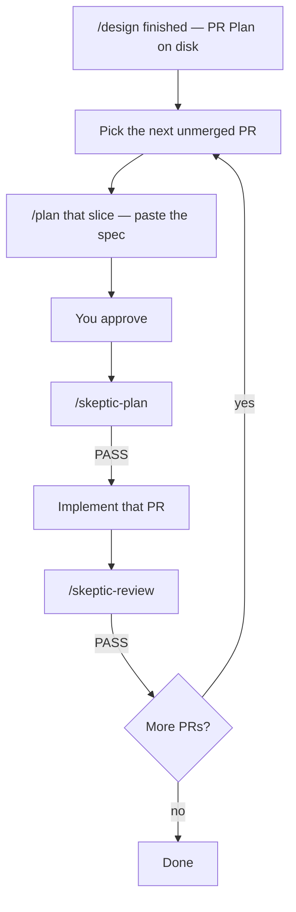

<p align="center">
  
</p>

<h1 align="center">Devin Skills</h1>

<p align="center">
  <strong>Grok-style skills with a real write-lock for the Devin CLI.</strong><br>
  Don't implement until the plan survives.<br>
  Don't claim done until the diff survives.
</p>

<p align="center">
  <a href="LICENSE"></a>
  <a href="https://docs.devin.ai/cli"></a>
  <a href="https://www.python.org/"></a>
  <a href="https://github.com/hilather/devin-skills/actions"></a>
</p>

<p align="center">
  
</p>

---

## What this is

[Devin CLI](https://docs.devin.ai/cli) is a local coding agent. You can give it skills (slash-command prompts) that *ask* it to plan, review, and be careful.

Asking is not enough. A prompt cannot stop Devin from editing your files.

**Devin Skills** ports the useful parts of a Grok Build workflow onto Devin, then adds the missing piece: a **lock**.

After you install it, Devin cannot write to the workspace until a plan skeptic signs off, and it cannot say "I'm done" until a code skeptic signs off. The signatures are HMAC-signed by the gate script. Devin cannot mint them by writing `passed` into a file.

Skills are the playbook. The lock is the product.

## Why it exists

Grok Build has skills **and** a harness that actually enforces them: plan first, independent skeptics, no "done" until the diff survives.

Devin has skills, custom subagents, and hooks. Skills are prompts. Custom subagents are personas. Only **hooks** can return `decision: block`.

This repo uses each layer for what it is good at:

| Layer | What it does |
| --- | --- |
| Devin's built-in `/plan` | Read-only draft of the work. We do not replace it. |
| `hooks/devin-gates.py` | The lock. Blocks writes and Stop until skeptics pass. |
| Custom subagents | Read-only reviewers: plan-skeptic, code-skeptic, and friends. |
| Skills | Slash commands that run the loops (`/design`, `/skeptic-plan`, `/skeptic-review`, …). |
| Optional plugin | A shareable copy of the skills. **No lock.** |

If you only install the plugin, you get nicer prompts and Devin can still edit anyway. Run `install.sh` if you want the lock.

## How a session goes



Default is **locked**, even if you never ran `/plan`. Tiny tasks skip the ceremony with `/gate-bypass <reason>` — a reason is required, and it is audited.

`/design` does not unlock the workspace. It only writes a spec under a gate-issued design root. You still `/plan` → `/skeptic-plan` before implementing.

### How `/design` goes

A read-only `design-writer` drafts. A read-only `design-reviewer` attacks. The parent is the only process that writes files. They loop until zero open issues. No round cap. Nits count.



The doc must include **Key Decisions** and a **PR Plan**. `/design` **writes** that execution plan. It does **not** run it.

### After design: implement the PR Plan

The PR Plan is ordered, independently mergeable slices (`### PR 1:`, files, dependencies, description). A later execute path can parse that shape — there is no skill that walks it for you. Devin's built-in `/plan` is the implementation planner. Feed it one slice at a time (or the whole spec, if the change is small).



Do not add a skill named `plan`. Do not invent a `/goal` that "just keeps going" through the PR list — Devin has no host harness for that. Details: **[docs/usage.md](docs/usage.md#from-design-to-implementation)**.

## Install

Needs [Devin CLI](https://docs.devin.ai/cli) and Python 3. No npm, no extra packages.

```sh
git clone https://github.com/hilather/devin-skills.git
cd devin-skills
sh install.sh
```

That installs to `~/.config/devin/`:

- **Copies** the gate script (the lock is never a live symlink into this repo).
- **Symlinks** the skills and agents so commands are `/design`, not `/devin-skills:design`.
- **Merges** the hook beside existing [herdr](https://github.com/herdrdev/herdr) hooks. It does not replace your `config.json`.

Then, in Devin:

```
/hooks
```

You should see both `herdr-agent-state.sh` (if you had it) and `devin-gates.py`.

Full flags, project-local install, and what the script touches: **[docs/install.md](docs/install.md)**.

Uninstall: **[docs/uninstall.md](docs/uninstall.md)**.

## How to use it

Everyday loop, in Devin:

1. **`/plan`** the change. This is Devin's built-in planner. Approve it when it looks right. Approval does **not** unlock writes.
2. **`/skeptic-plan`**. A fresh `plan-skeptic` subagent tries to break the plan (wrong assumptions, missing steps, unverified claims). Writes unlock only on `GATES_VERDICT: PASS`.
3. **Implement.** Devin can edit now.
4. **`/skeptic-review`**. A finding-skeptic, then a code-skeptic, review a frozen diff. Stop unlocks only on a code-skeptic PASS.

Optional: **`/design`** before `/plan` when you want a spec. That skill's output is the **PR Plan** — the execution plan. It does not implement. Take each `### PR N:` through `/plan` → `/skeptic-plan` → implement → `/skeptic-review`.

Check the lock any time:

```
/gate-status
```

A one-line typo, a docs tweak, a test you need before the skeptic:

```
/gate-bypass tiny typo in README
```

New session? Locked again. Bypass is per-session.

Step-by-step with examples: **[docs/usage.md](docs/usage.md)**.

## Commands

| Command | What it does |
| --- | --- |
| `/plan` | **Built into Devin.** Read-only draft. Do not add a skill named `plan`. |
| `/design` | Writer/reviewer loop. Writes a spec with **Key Decisions** and a **PR Plan**. Does not implement. |
| `/skeptic-plan` | Independent plan skeptic. Lifts the **write-lock** on PASS. |
| `/skeptic-review` | Finding-skeptic, then code-skeptic, on a frozen diff. Lifts the **Stop-lock** on PASS. Needs a passed plan first. |
| `/gate-bypass <reason>` | Audited skip for this session. Reason is required. Not Devin's `/bypass` / `/yolo`. |
| `/gate-status` | Print lock state. Read-only. |

There is **no** `/goal`. Grok's goal harness is host logic Devin does not have. Faking it with a prompt would look like the real thing and fail silently. See [What we did not copy](docs/how-it-works.md#what-we-did-not-copy).

## Bypass

| Mechanism | Scope | When to use it |
| --- | --- | --- |
| `/gate-bypass <reason>` | This session | Tiny work. Reason required. Audited. |
| `DEVIN_GATES_OFF=1` | Process tree of the shell that **starts** `devin` | Dogfooding the gate itself. Setting it on a tool call does **not** unlock. |
| `sh uninstall.sh` | Until you reinstall | Take the lock off this machine. |
| Devin `/bypass` / `/yolo` / `/dangerous` | Devin permission mode | **Not** a gate override. Hooks may still fire. |

`echo passed > marker` does not unlock. Minting happens only inside the gate script.

## herdr

If you already use herdr, keep it. `install.sh` appends the gate beside those hooks and leaves herdr command strings byte-identical. Uninstall removes only the gate. Details in [docs/install.md](docs/install.md#herdr).

## Optional plugin

Skills without the lock, for sharing:

```sh
devin plugins install --local /path/to/devin-skills/plugin
```

Commands become `/devin-skills:design` instead of `/design`. Plugin hooks fail-open, so this folder has **no** `hooks.json`. User-level `install.sh` is still how writes actually get locked.

## Tests

Python 3 stdlib only:

```sh
python3 -m unittest tests.test_install_merge tests.test_gate -v
```

Live Devin checklist (throwaway repo): **[docs/smoke-test.md](docs/smoke-test.md)**.

## Docs

| Doc | What's in it |
| --- | --- |
| [docs/usage.md](docs/usage.md) | Everyday workflow, commands, bypass, FAQ |
| [docs/install.md](docs/install.md) | Install, flags, herdr, project mode |
| [docs/uninstall.md](docs/uninstall.md) | Clean removal and backup restore |
| [docs/how-it-works.md](docs/how-it-works.md) | Layers, Grok mapping, honest limits |
| [docs/smoke-test.md](docs/smoke-test.md) | Live Devin verification checklist |

## Layout

```
hooks/devin-gates.py     # the lock
hooks/hook-entries.json  # what install.sh merges into config.json
install.sh / uninstall.sh
skills/                  # /design /skeptic-plan /skeptic-review /gate-bypass /gate-status
agents/                  # five read-only personas
rules/AGENTS.md          # short pointers, not a playbook
docs/                    # this documentation
plugin/                  # optional share pack — no hooks
tests/                   # unittest; no live Devin required
vendor/agent-hints/      # vendored hunt lists for the skeptics
```

## Honest limits

The lock proves that the skeptic **profile** emitted PASS. It cannot prove the parent did not jailbreak the skeptic's task prompt. Large diffs may truncate when pasted. Stop is allowed after three blocked attempts on the same prompt so Devin cannot loop forever — that is a known gap; `/gate-bypass` is the honest skip.

The full list lives in [docs/how-it-works.md](docs/how-it-works.md#honest-limits).

## License

[MIT](LICENSE).
