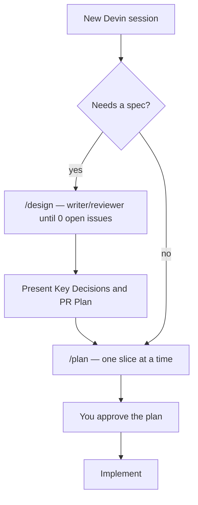
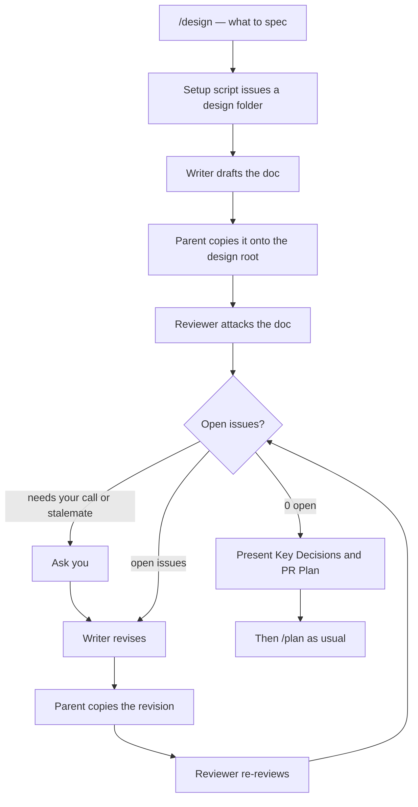

<p align="center">
  
</p>

<h1 align="center">Devin Skills</h1>

<p align="center">
  <strong>Grok-style /design for the Devin CLI.</strong><br>
  Spec first. Then Devin's builtin /plan. Then implement.
</p>

<p align="center">
  <a href="LICENSE"></a>
  <a href="https://docs.devin.ai/cli"></a>
  <a href="https://www.python.org/"></a>
  <a href="https://github.com/hilather/devin-skills/actions"></a>
</p>

<p align="center">
  
</p>

---

## What this is

[Devin CLI](https://docs.devin.ai/cli) is a local coding agent. This repo gives it a **design loop** like Grok Build's `/design`, and leaves implementation planning to Devin's built-in `/plan`.

There is **no write-lock**. Devin can edit as soon as you want it to. Skills are the playbook.

| Layer | What it does |
| --- | --- |
| Devin's built-in `/plan` | Read-only draft of the work. We do not replace it. |
| `/design` | Writer/reviewer loop. Writes a spec with **Key Decisions** and a **PR Plan**. Does not implement. |
| Custom subagents | Read-only `design-writer` and `design-reviewer`. |
| Optional plugin | Same skills, namespaced as `/devin-skills:design`. |

Do not add a skill named `plan`.

## How a session goes



`/design` is optional. Skip it for typos, one-file bugfixes, and anything you would not write a spec for by hand.

### How `/design` goes

A read-only `design-writer` drafts. A read-only `design-reviewer` attacks. The parent is the only process that writes files. They loop until zero open issues. No round cap. Nits count.



The doc must include **Key Decisions** and a **PR Plan**. `/design` **writes** that execution plan. It does **not** run it. Take each `### PR N:` through `/plan`, then implement.

## Install

Needs [Devin CLI](https://docs.devin.ai/cli) and Python 3. No npm, no extra packages.

```sh
git clone https://github.com/hilather/devin-skills.git
cd devin-skills
sh install.sh
```

That installs to `~/.config/devin/`:

- **Symlinks** the skills and agents so the command is `/design`, not `/devin-skills:design`.
- **Merges** a short `AGENTS.md` pointer. It does not replace your `config.json`.
- **Removes leftover write-lock hooks** (`devin-gates.py`) if an older version of this repo installed them. herdr entries stay.

Full flags and what the script touches: **[docs/install.md](docs/install.md)**.

Uninstall: **[docs/uninstall.md](docs/uninstall.md)**.

## How to use it

1. Optional: **`/design`** when the change needs a spec.
2. **`/plan`** the change (or one PR slice). This is Devin's built-in planner. Approve it when it looks right.
3. **Implement.**

```
/design replace the sync job with a queue worker. Keep the existing Job row shape. No new infra.
```

Put the problem, constraints, and paths in the argument. Vague prompt → vague spec.

You get files under `~/.cache/devin-skills/design/<id>/`:

| File | What it is |
| --- | --- |
| `design-doc.md` | The spec. Always includes Key Decisions and a PR Plan. |
| `summary.md` | Short writer's summary. |
| `review.md` | Review notes (open / addressed / wontfix). |

Then **stop using `/design`**. It does not implement.

Full walkthrough: **[docs/usage.md](docs/usage.md)**.

## Commands

| Command | What it does |
| --- | --- |
| `/plan` | **Built into Devin.** Read-only draft. Do not add a skill named `plan`. |
| `/design` | Writer/reviewer loop. Writes a spec with **Key Decisions** and a **PR Plan**. Does not implement. |

## Optional plugin

Same skills, for sharing:

```sh
devin plugins install --local /path/to/devin-skills/plugin
```

Commands become `/devin-skills:design` instead of `/design`. User-level `install.sh` is how you get the short name.

## Tests

Python 3 stdlib only:

```sh
python3 -m unittest tests.test_install_merge -v
```

Live Devin checklist (throwaway repo): **[docs/smoke-test.md](docs/smoke-test.md)**.

## Docs

| Doc | What's in it |
| --- | --- |
| [docs/usage.md](docs/usage.md) | Everyday workflow and how to use /design |
| [docs/install.md](docs/install.md) | Install, flags, leftover-lock removal |
| [docs/uninstall.md](docs/uninstall.md) | Clean removal |
| [docs/how-it-works.md](docs/how-it-works.md) | Writer/reviewer loop internals |
| [docs/smoke-test.md](docs/smoke-test.md) | Live Devin verification checklist |

## Layout

```
skills/design/           # /design orchestrator
agents/                  # design-writer, design-reviewer
rules/AGENTS.md          # short pointers
install.sh / uninstall.sh
docs/
plugin/                  # optional share pack
tests/                   # unittest; no live Devin required
```

## License

[MIT](LICENSE).
