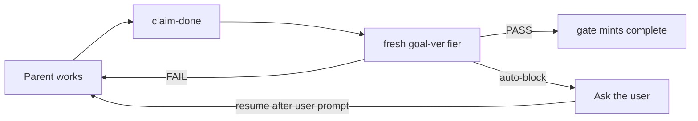

# How it works

Plain-English internals for people who want to know what they are installing. Everyday use is in [usage.md](usage.md).

## The one-sentence version

Skills tell Devin *what* to do. The gate hook is the only layer that can *stop* it.

## Layers

| Layer | Role | Can block writes? |
| --- | --- | --- |
| Devin builtin `/plan` | Host read-only draft, approval UI, `exit_plan_mode`. Not our code. | No |
| User/project hooks (`devin-gates.py`) | HMAC markers, write-lock, Stop-lock, audited bypass, signed goal state. | **Yes** |
| Custom subagents | Read-only personas (`design-writer`, `design-reviewer`, `plan-skeptic`, `finding-skeptic`, `code-skeptic`, `goal-verifier`, `goal-strategist`, `pr-reviewer`), `model: swe-2-high`. | No |
| Skills | Orchestrators and slash commands. Prompts only. | No |
| Tiny `AGENTS.md` | Pointers, not playbooks. | No |
| Optional `plugin/` | Skills + agents + the tiny rule, for sharing. **No `hooks.json`.** | No — plugin hooks fail-open |

Plugin packaging must not carry the lock. If a plugin hook fails to load, Devin continues without it.

## Why markers are signed

A naive lock would look for a file named `plan-passed`. Devin could write that file itself.

The gate:

- Holds a secret in the state directory (mode `0600`), generated at install, not writable by the agent.
- Mints markers itself, HMAC-signed, only when a `plan-skeptic` / `code-skeptic` subagent result contains `GATES_VERDICT: PASS` (with extra guards for code: `plan-passed` present, `source_seq` matching).
- Refuses forged files.

`/gate-bypass <reason>` is also HMAC-audited and scoped to the current session id.

## Write-lock vs Stop-lock

**Write-lock.** After `/plan` is approved — and by default in any normal session — workspace writes stay blocked until a plan-skeptic marker exists.

**Stop-lock.** "I'm done" stays blocked until a code-skeptic marker exists, unless:

- `mode == plan` (from `write_plan`, cleared on `exit_plan_mode` — **not** parsed from prompt text)
- `source_seq == 0` (no successful source mutations this session)
- an audited `/gate-bypass`
- `DEVIN_GATES_OFF=1` in the shell that starts `devin`
- this `prompt_id` has already been Stop-blocked 3 times (loop guard)

An attached `active` **goal blocks Stop ahead of the `mode == plan`, `source_seq == 0`, and `code-passed` early-allows** — a zero-mutation research goal still gates, even in plan mode — while honoring `gates_off`, an audited override, and the loop guard. Paused, blocked, cleared, and completed goals impose nothing; ordinary rules apply. Goal and code blocks share the same 3-per-`prompt_id` budget.

The loop guard exists because Devin can retry a blocked Stop forever. After 3, the turn is allowed to end. That residual is **High** for the Stop product claim. The honest skip for real work is `/gate-bypass`, not Stop-retry.

`source_seq` increments on source-mutating tools (`write` / `edit` / `apply_patch` / …). A later edit after a code PASS clears the marker so you cannot remint from a stale review.

## Grok → Devin mapping

This repo is an approximation of a Grok Build workflow on Devin CLI (verified on **3000.10.21**). Honest gaps included.

| Grok | Devin approximation | Honest gap |
| --- | --- | --- |
| `/plan` harness: read-only except plan file; approval UI | **Keep built-in `/plan`.** Hooks take over **after** approval until a skeptic marker exists. | No `/view-plan` skill. Devin's plan file lives under `~/.devin/plans/`. We do not replace the approval UI. |
| `/design` writer/reviewer/`resume_from` | Orchestrator skill + read-only `design-writer` / `design-reviewer`. Parent copies fenced markdown onto `design_allow_root`. `resume` for revise / re-review. | Parent sees a distilled result, not the raw transcript. v1 does **not** assume child `write` re-enters hooks. |
| `/goal` (host rounds, pause/resume/clear, token budget, independent evidence review) | **Gate-backed `/goal`.** Workspace-scoped signed goal state; `pause`/`resume`/`clear`/`update` CLI; Stop blocked while an attached goal is `active`; completion minted **only** by a fresh `goal-verifier` `GATES_VERDICT: PASS`; post-completion mutations reopen the goal. | No host round driver — "rounds" are turn structure. No token budget — `verifier_sweeps` is the only rounds metric. `goal-pause` lands at the next hook boundary, not mid-turn. The agent can still `goal-clear` itself (audited, like `/gate-bypass`). Stop-loop guard unchanged. |
| Goal completion evaluator (hidden per-round continue/candidate/blocked) | **Explicit, enforced claims.** `goal-update --claim-done` binds `claim_seq = mutation_seq`; a verifier spawn is refused without a current claim, and `unclaimed_rounds` escalates never-claiming to `unclaimed-work:` auto-block. `--blocked` is a streak (`DEVIN_GOAL_BLOCKED_STREAK`, default 3). | Still no hidden classifier judging claim honesty — the verifier checks the claim, the counters bound the timing. |
| Skeptic panel (`goal_verifier_count` parallel skeptics, resumed skeptic-0) | **One fresh `goal-verifier` per sweep** + `PRIOR_GAPS` injection for cross-attempt memory + a `goal-verdict` JSON block the gate fingerprints. | Fresh-spawn witness binding makes a resumed panel member unportable; `PRIOR_GAPS` supplies memory a panel had. |
| Same-gaps stall detection (`reverify_after`, auto-pause on no progress) | **Gate-owned gap fingerprint** (normalized `(kind, item)` set) in signed state; 2 consecutive identical FAILs auto-block `no-progress:`; `goal-resume` resets the stall slate. | Fingerprint ignores detail text — rephrased identical gaps still match, but a verifier that keeps inventing *new* gaps is bounded by the sweep cap instead. |
| `blocking: none/contradiction/unverifiable` classification | **Adopted verbatim** in the `goal-verdict` JSON contract; `BLOCKED` verdict auto-blocks with `blocking:` reason. | None — same taxonomy. |
| Repeated external `blocker_key` pause | **Adopted.** `last_blocker_key` in signed state; a repeat across verifier BLOCKEDs or manual `--blocker-key` reports escalates to `external-repeat:`. | None — same mechanism. |
| Goal strategist (structural replan after whack-a-mole; WHAT frozen) | **Refiring gate event + `goal-strategist` profile.** Every 3 consecutive *distinct* FAIL gap sets: sweep cap +2 (bounded +4), stall threshold relaxed 2→5, `strategist_pending` set — claims refused until `<goal_allow_root>/strategy.md` exists, written after the fire (mtime-window checked). The strategist spawn itself is gated on the pending flag. | The artifact's existence and recency are enforced; its content quality is not — the strategist is advice, not a witness. |
| Classifier run cap (`classifier_max_runs`) | `GOAL_SWEEP_CAP = 6` (+2 strategist bonus, max 8; `DEVIN_GOAL_SWEEP_CAP` env, floor 1). A FAIL sweep is the retry unit. | Cap bounds whack-a-mole rather than claim spam — there is no in-flight double-claim to count. |
| Fail-open on verifier error | **Fail-closed.** Malformed/contradictory `goal-verdict` JSON discards findings; a missing verdict counts as a FAIL sweep; a PASS contradicted by its own findings or per-item verdicts demotes to FAIL. | No `FailOpenAchieved` — the verifier is the sole mint gate, so fail-open would be self-certification. |
| Plan skeptic before implement (3-sweep cap, BLOCKED, failed-sweep autopsy) | `/skeptic-plan` + `plan-skeptic` + **write-lock hook**. Fresh subagent per sweep. Lock lifts only on `GATES_VERDICT: PASS`. | Hook cannot run the skeptic (timeouts). A parent that jailbreaks the skeptic via the task prompt can still produce PASS. Residual, documented. |
| Code skeptic at done (finding-skeptic + implementation sweep) | `/skeptic-review` + `finding-skeptic` + `code-skeptic` + **Stop hook**. Auto-mint requires a `code-skeptic` PASS whose witness `source_seq` is ≥ current `source_seq`. | Same residual. Stop-loop guard is required. Parent must embed the **full** `git diff` in the task; large diffs may truncate. |
| Independent skeptic (fresh, no attachment) | Fresh Devin subagent per sweep; parent must not self-review. Profiles omit write/edit/`exec`. | Parent still writes the task prompt (jailbreak residual) **and** the pasted diff. |
| `/execute-plan` (PR-Plan DAG → parallel worktree implementers → reviewer loops → Graphite/plain-git stack) | **`/execute-plan` skill + `devin_gates_execplan` splice.** `allow-exec-plan` issues a run root (`~/.cache/devin-skills/execute-plan/<PLAN_ID>/`); `exec-plan-validate` runs the vendored `validate-plan.py` while locked; the parent implements each PR inline on a linear branch stack (`checkout -B <branch> <prev_tip>`); a read-only `pr-reviewer` reviews each diff; `--resume` reconciles under a positional retry rule. | Sequential only — no subagent isolation, `wait_any`, or kill. Parent implements (child `write` re-entry unverified). `pr-reviewer` is non-minting — a `code-skeptic` PASS mid-run would falsely satisfy the Stop-lock on partial coverage. Plain-git only, no `memory.py` (`lessons.md` stands in), no mid-stack retry, `main` hardcoded. |

## What we did not copy

**Do not ship a prompt-only `/goal` imitation.** Grok `/goal` is host logic, not a prompt: token budget, pause/resume/clear, autonomous multi-round driver, and an independent evidence review that can **refuse** completion. A skill named `/goal` that only *says* "keep going" would let the parent mark itself complete — it would *look* like Grok `/goal` and fail silently. That is still forbidden.

What ships instead is the gate-backed approximation: the durable parts of the harness — signed state, the completion gate, the independent refusal — live in the gate, the only layer that can enforce them.

Everyday how-to and the full loop: [usage.md](usage.md#how-to-use-goal).

- **`/goal <objective>`** registers a workspace-scoped objective in an HMAC-signed goal file and attaches the session. `set-goal --kind code-change|research|analysis|general` records the goal's shape — it biases the verifier's evidence emphasis but is not itself enforcement. `goal-status` reports telemetry (`kind`, `claims`, `updates`, `age`, `tool_errors`) alongside the enforcement counters.
- **`goal-update`** is the audited progress-reporting analog (`--message`, `--claim-done`, `--blocked --reason [--blocker-key k]`).
- **`goal-pause` / `goal-clear`** transition status; `--reason` is required and audited, like `/gate-bypass`. **`goal-resume`** attaches the calling session. From `paused`/`blocked` it requires `--reason` **and a cleared user-prompt boundary** — pause, block, and every auto-block set `needs_user_prompt` in the signed file, cleared by a `UserPromptSubmit` hook event (host-emitted in normal flow; a synthesized event is possible only via an audited exec of the gate itself — same forge surface as the whole hook protocol — and `DEVIN_GOAL_PROMPT_GATE=0` disables the check for hosts that never fire it). An attach-only resume on an already-`active` goal — a new session adopting the goal — needs neither. A status-changing resume resets the stall slate (gap fingerprint + streak counters + `blocked_attempts`); sweeps, cap bonus, `last_blocker_key`, and the infra-error streak persist.
- **Self-reported blocked is a streak, not a switch.** The first `DEVIN_GOAL_BLOCKED_STREAK`−1 `goal-update --blocked` attempts (default: 2) are refused "keep working"; the threshold attempt is honored and sets `needs_user_prompt`. The counter resets on claim, counted sweep, resume, or reopen — deliberately **not** on `--message`, so alternating notes and quit attempts cannot evade it.
- **Claims are enforced, not advisory.** `--claim-done` records `claim_seq = mutation_seq`; a `goal-verifier` spawn is refused without a claim, or after any workspace mutation stales it. Workspace mutations and `--message` while `active` increment `unclaimed_rounds` — nudge reminders past `DEVIN_GOAL_CLAIM_NUDGE` (default 8), auto-block `unclaimed-work:` at `DEVIN_GOAL_UNCLAIMED_CAP` (default 40, `0` disables). Session `/gate-bypass` does **not** lift these witness semantics; only `DEVIN_GATES_OFF=1` does.
- **One verifier in flight per session.** The spawn gate binds `{goal_id, mutation_seq, verify_epoch, task_sha}` into session state only on an *allowed* spawn and refuses a second fresh spawn while a binding is still current; a result consumes its binding only when the spawn-task sha matches, so a foreign or orphaned result can neither mint nor free the slot. A refused spawn cannot overwrite an in-flight binding; a binding staled by a mutation/epoch bump is voided at the next spawn (its task sha recorded) so the orphaned result lands late even on an identical-task respawn — a stale result can never mint against a rebound binding. Attach/resume never frees a binding; a wedged in-flight binding is recovered via `goal-pause` → user prompt → `goal-resume`, which stales it for the next spawn. A resumed verifier spawn is never a witness — no claim, no binding.
- **The checklist has a signed baseline.** `goal-baseline` snapshots `<goal_allow_root>/checklist.md` verbatim into the signed goal file (once-only; the first `--claim-done` captures it implicitly; a missing/empty/oversized — `>16000` chars — checklist refuses rather than truncates; checklist-less goals stay legal). On every claim and verifier spawn the gate compares the live hash to the baseline and stamps sticky `checklist_drifted` on divergence — legitimate refinement is allowed, but it is visible to the verifier, which must judge whether it weakens the bar.
- **The verifier task is bound to the signed objective verbatim.** The spawn gate refuses a `goal-verifier` task that does not contain the signed `objective` string — paraphrase is rejected. Honest limit: this bounds sloppy drift, not a determined parent forging pasted content — the gate-side drift stamp is the authoritative check on actual checklist changes.
- **Completion is a gate state transition, not a self-report.** Only a fresh `goal-verifier` subagent emitting `GATES_VERDICT: PASS` moves `status=complete` — the verifier judges a parent-maintained `checklist.md` plus an evidence bundle, per item (`VERIFIED` / `REFUTED` / `UNVERIFIABLE — needs <evidence>`).
- **Stopping is also a gate state transition.** The signed goal file tracks a gap fingerprint (normalized `(kind, item)` set), streak counters, sweep count, cap bonus, `last_blocker_key`, `unclaimed_rounds`, and `consecutive_tool_errors`. The gate auto-blocks with a prefixed `blocked_reason`: `no-progress:` (2 consecutive identical FAIL gap sets; 5 after the strategist grant), `sweep-cap:` (6 sweeps, +2 per strategist fire max +4, `DEVIN_GOAL_SWEEP_CAP` env floor 1), `blocking:` (verifier `GATES_VERDICT: BLOCKED` — all residuals `contradiction`/`unverifiable`), `external-repeat:` (same non-null `blocker_key` twice), `unclaimed-work:` (unclaimed cap), `infra-errors:` (`consecutive_tool_errors` at `DEVIN_GOAL_ERROR_STREAK`, default 3). `goal-status` surfaces the cap, stall counter, and reason.
- **Infra outages stop the loop instead of burning sweeps.** Consecutive failures on `run_subagent`, `mcp_call_tool`/`mcp__*`, or `write_to_process` increment `consecutive_tool_errors` (workspace-scoped, persists across pause/resume; an in-scope success resets). `exec`, `read`/`grep`/`find`, and `write`/`edit` failures deliberately do **not** count — a failing test or a stale `old_string` is work, not infra.
- **The strategist re-fires and leaves an enforced artifact.** Every 3 consecutive FAIL sweeps with *different* gap sets fires the strategist: cap +2 (bounded +4), stall threshold 5, and `strategist_pending` — `--claim-done` refuses until `strategy.md` exists under `goal_allow_root`, written after the fire (mtime-window checked). A status-changing user-gated resume is the escape; an attach-only resume does not clear it. The `goal-strategist` spawn is itself gated on the pending flag.
- **Verdict parsing takes the last `GATES_VERDICT` match.** The goal splice module rebinds the gate's `parse_verdict` to last-match, so a quoted early verdict inside pasted evidence cannot mint or refute — this covers goal-verifier and all three skeptic profiles. Caveat: the rebind happens inside the splice — if `devin_gates_goal.py` is missing or fails to import (see below), parsing silently reverts to first-match while the profiles still assert last-match. Skill-side neutralization (stripping `GATES_VERDICT:` lines from inlined text) remains defense-in-depth either way. A PASS contradicted by its own `goal-verdict` JSON, non-empty findings, or `REFUTED`/`UNVERIFIABLE` per-item lines **demotes to FAIL**; contract-breaking output fingerprints as a `malformed` sentinel so it stalls via `no-progress`, not the strategist path.
- **The verifier classifies residuals honestly.** Each finding in the `goal-verdict` JSON block carries `blocking: none|contradiction|unverifiable` — ordinary model-fixable gaps keep the loop going; contradiction/unverifiable residuals escalate to the user. Anti-ratchet rules (plus `PRIOR_GAPS` / `PRIOR_FINDINGS` injection) forbid raising the bar between sweeps.
- **A workspace mutation counter (`mutation_seq`) binds the witness to the tree it verified.** Any later source mutation — in any session — reopens the goal to `active`, and Stop re-blocks because the attach survives completion.

What Devin CLI 3000.10.21 still does not give us, and what `/goal` honestly does not do:

- **Host-driven observe–plan–act rounds.** Nothing advances the goal between turns; the Stop-block only keeps an in-flight turn alive.
- **A token budget.** `verifier_sweeps` is the only "rounds" metric — bounded by the sweep cap, not by tokens.
- **Mid-turn pause.** `goal-pause` takes effect at the next hook boundary.
- **An un-escapable guarantee.** The parent can `goal-pause`/`goal-clear`/`--blocked` itself — `--blocked` is now a 3-attempt streak, and resuming a stopped goal requires the user's next prompt, but pause/clear remain self-serve, mitigated by mandatory `--reason` and the audit trail, identical to `/gate-bypass`. The 3-per-`prompt_id` Stop-loop guard can also end a turn unverified (**High** residual, unchanged).
- **A fully authenticated verifier channel.** The claim, baseline hash, drift stamp, and verbatim-objective check are gate-side and authoritative, but the *content* pasted into the verifier task — baseline text, evidence excerpts, prior findings — is parent-controlled. A determined parent can paste a doctored baseline; the signed copy in the goal file only proves what the checklist was, not that the verifier saw it honestly.

The goal code itself ships as `hooks/devin_gates_goal.py`, a separate module. `hooks/apply_goal_patch.py` splices a small wrapper block into `devin-gates.py` at install time — the gate source is a protected path inside sessions, so the feature cannot live in a file the agent edits. If `devin_gates_goal.py` is missing or fails to import, the splice fails silently and the gate runs with **no goal enforcement** — the rest of the lock is unaffected.

## Honest limits

- **Parent jailbreak.** The parent writes the skeptic `task`. Instructing PASS can still mint. The lock verified that the profile emitted PASS, not that the plan/diff is independently good.
- **Stop-loop cap of 3** per `prompt_id` is required (Devin can loop on blocking Stop) and is a **High** residual for the Stop claim.
- **Large diffs** may truncate in the pasted `task`.
- **`apply_patch` schema** on 3000.10.21 is not fully known: fail closed while locked; after unlock, fail open except a protected-path scan.
- **Custom subagents** are experimental; pin Devin 3000.10.21 in mind when the format moves.
- **Builtin `/bypass` / `/yolo` / `/dangerous`** are Devin permission mode, not a gate override. If a future Devin build skips PreToolUse in permission-bypass, the lock dies. Treat that as "permission-bypass disables the lock." See [smoke-test.md](smoke-test.md) §8.

## Design-time writes

`/design` needs somewhere to put artifacts while the workspace is still locked. The gate's `allow-design` subcommand issues a `design_allow_root` (usually under `~/.cache/devin-skills/design/<id>/`). Parent writes succeed there. Workspace source stays locked. Do not symlink out of that root.

The loop itself:

Writer and reviewer have no `write` / `edit` / `exec`. That is why the parent copies fences. Child `write` is not assumed to re-enter hooks. Full loop: [usage.md](usage.md#how-to-use-design).

### The PR Plan walker: `/execute-plan`

`design-writer` must emit `## PR Plan` with `### PR N:` slices (files, dependencies, description) so the execute path can parse it deterministically. `/execute-plan <design-doc>` runs it end-to-end:

- **Gate affordances while locked** ship via `hooks/devin_gates_execplan.py` — the same splice pattern as `/goal` (`hooks/apply_execplan_patch.py` wraps `dispatch`/`run_hook`/`main` before the `if __name__` anchor; install-time only, the gate source is never edited in-session). It adds `allow-exec-plan [--id <8hex>]` (run root `~/.cache/devin-skills/execute-plan/<PLAN_ID>/`, `0700`, `exist_ok` for resume, session keys `exec_plan_id`/`exec_plan_allow_root`, last call wins), `exec-plan-validate --file <path>` (runs `hooks/devin_execplan_validate_plan.py` — the vendored validator installed beside the gate — with a 30 s timeout; expanduser → realpath → protected-path refusal; rc 0/1 relayed, rc 2 on infra failure so the skill can fall back), locked-phase exec-allowlisting for both subcommands, write-allow under the run root, a `status` line `exec-plan: <id>`, and a `_bind`-time `READONLY_PROFILES += pr-reviewer` so reviewer spawns do not phantom-bump `source_seq`. Missing module → silent no-splice; while locked, `allow-exec-plan` failure stops the run.
- **Linear stack ancestry** replaces Grok's DAG ancestry + assembly-time cherry-pick: each PR branch is `checkout -B`'d off the last `completed` node's `commit_sha` at the top of its iteration. Sequential topological execution makes that base contain every declared dependency's commits; `dependencies` govern readiness and cascade-skip only. No merges, no cherry-picks, no rebase path.
- **Resume** normalizes the tree (`checkout -f main` → `reset --hard` → `clean -fd` when dirty or on a run branch), then reconciles *statuses only* under the positional retry rule — a node goes back to `pending` only when no later `linearized_order` node is `completed`. `prev_tip` is derived, never persisted.
- **The reviewer never mints.** `pr-reviewer` is read-only and emits no `GATES_VERDICT`; the parent counts `Status: open` and runs the fix loop itself. `/skeptic-review` still covers the whole stack before done.

The manual per-slice path (`/plan` → `/skeptic-plan` → implement → `/skeptic-review` per PR) remains the human-approval alternative. See [How to use /execute-plan](usage.md#how-to-use-execute-plan).
