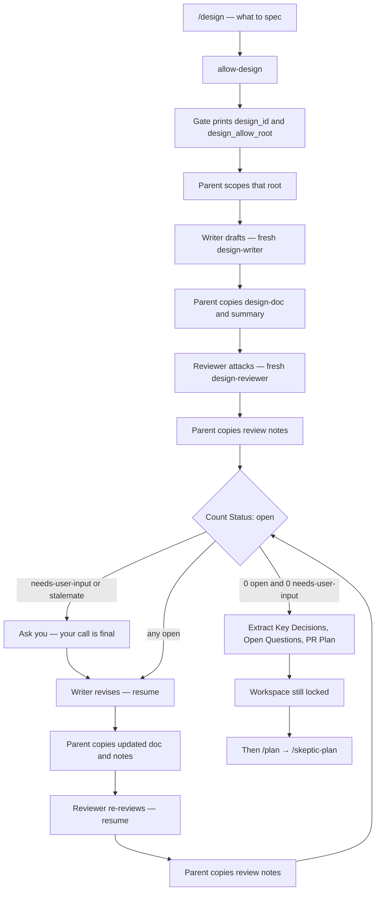
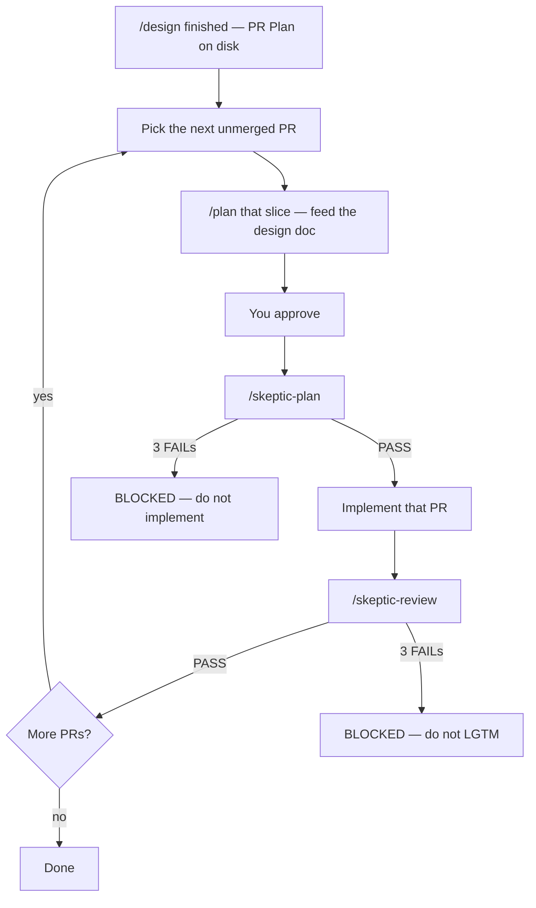

# How to use Devin Skills

This is the everyday guide. For why the lock exists and what it cannot do, see [how-it-works.md](how-it-works.md). For install flags, see [install.md](install.md).

You need Devin CLI and a completed `sh install.sh`. Confirm with `/hooks` — `devin-gates.py` should be listed.

## The default: locked

A new session cannot edit the workspace. That is on purpose.

- **Writes** (edit, write, apply_patch, most mutating exec, GitHub MCP that changes things) stay blocked until a **plan-skeptic** PASS exists.
- **Stop** ("I'm done") stays blocked until a **code-skeptic** PASS exists, unless nothing actually changed, you set a bypass, or the Stop-loop guard fires.

Approving `/plan` is not a skeptic PASS. You still need `/skeptic-plan` before implementation.

## Everyday workflow

### 1. Plan

```
/plan add a retry around the GitHub API client
```

Devin's built-in planner drafts a plan (read-only). Approve it when it looks right.

Do **not** name a skill `plan`. Do **not** start implementing yet — writes are still blocked.

### 2. Skeptic the plan

```
/skeptic-plan
```

The parent spawns a **fresh** `plan-skeptic` subagent. That persona is read-only. It tries to find holes: unverified assumptions, missing steps, wrong files, claims the codebase contradicts.

- **PASS** — the gate mints a plan-skeptic marker. Writes unlock.
- **FAIL** — you revise the plan and spawn another fresh skeptic. Cap is 3 FAIL sweeps, then **BLOCKED**.
- **BLOCKED** — do not implement. Fix the plan with the user, or `/gate-bypass` with a reason if you truly want to skip.

Check:

```
/gate-status
```

You want `plan-skeptic: present` before you let Devin edit.

### 3. Implement

Now Devin can write. Do the work. Commit if you want — `git add` / `git commit` are not treated as source mutations.

### 4. Skeptic the diff

When the change is ready, freeze it. Do not keep editing during the review.

```
/skeptic-review
```

This:

1. Gathers the full candidate (`git status`, `git diff HEAD`, plus commits since the merge base unless you named a range).
2. Optionally runs `finding-skeptic` over a first-pass finding list.
3. Always runs a fresh `code-skeptic` on the pasted diff.

On PASS, the gate mints a code-skeptic marker and Stop is allowed.

If you edit source **after** a PASS, the code marker is cleared. You need another `/skeptic-review`. A stale PASS cannot be reused.

## Design docs

Before a big `/plan`, when the change needs a spec:

```
/design replace the sync job with a queue worker
```

This is a writer/reviewer loop, not an unlock. Workspace source stays locked. Artifacts go under a gate-issued design root (usually `~/.cache/devin-skills/design/<id>/`). The parent is the only writer — `design-writer` and `design-reviewer` are read-only personas. The parent copies their fenced markdown onto disk.

The doc must include **Key Decisions** and a **PR Plan**. Missing either is at least a major finding.



Rules that matter in practice:

- **Loop until zero open.** No max-rounds cap. Nits count.
- **Resume** the same writer/reviewer on revise and re-review. If resume fails, spawn fresh and paste the files — disk is the memory.
- **Escalate, don't spin.** A `wontfix` re-opened twice, or `needs-user-input`, goes to you. Your answer is final (`Status: addressed`).
- **`/design` does not lift the write-lock.** You still `/plan` → `/skeptic-plan` before implementing.

After it finishes, the parent reports the design-doc path, Key Decisions, review-round count, issues addressed by severity, and the PR Plan.

## From design to implementation

`/design` covers the **execution plan as a document**. It does not cover **running** that plan.

The writer is required to end the spec with `## PR Plan`, shaped so a later execute path can parse it:

```
## PR Plan

### PR 1: <title>
- **Files/components affected:** <paths>
- **Dependencies:** None
- **Description:** <brief description>

### PR 2: <title>
- **Files/components affected:** <paths>
- **Dependencies:** PR 1
- **Description:** <brief description>
```

Each PR must be independently reviewable and mergeable. Missing `## PR Plan` is at least a major review finding. Step 6 of `/design` extracts that section and presents it to you. Then the skill **stops**. Workspace source is still locked.

There is no Devin skill that walks `PR 1 … PR N` on its own. That would be Grok `/goal` (host rounds, pause/resume, an evidence review that can refuse completion). This repo does not ship `/goal`. The honest execute path is Devin's built-in `/plan`, one slice at a time:

```
/plan implement PR 1 from the design doc at ~/.cache/devin-skills/design/<id>/design-doc.md
```

Paste or point at the spec so `/plan` does not invent a different design. Approve. Then the usual lock:

1. `/skeptic-plan` — skeptic the implementation plan for **this** slice
2. Implement
3. `/skeptic-review`
4. Next PR



Small change, one PR in the plan? One `/plan` through the whole spec is fine. Multi-PR design? Do not squash them into one implementation plan unless you explicitly want that — the skeptic will (correctly) complain if the slice is not independently mergeable.

Do **not** name a skill `plan`. Do **not** ask `/design` to start implementing. Do **not** `/gate-bypass` just to skip from spec to code unless the work is actually tiny.

## Commands at a glance

| You type | What happens |
| --- | --- |
| `/plan …` | Built-in read-only draft. Approve in Devin's UI. |
| `/design …` | Writer/reviewer loop. Artifacts under the design root. |
| `/skeptic-plan` | Attacks the plan. Lifts the write-lock on PASS. |
| `/skeptic-review` | Attacks the frozen diff. Lifts the Stop-lock on PASS. |
| `/skeptic-review main...HEAD` | Same, but use this git range. |
| `/gate-bypass <reason>` | Unlock this session. Reason required. Audited. |
| `/gate-status` | Print markers, sweeps, override, `source_seq`. |

## Small tasks

Not every change deserves a skeptic gauntlet. For a typo, a comment, or "I just need to run the tests first":

```
/gate-bypass one-line typo in README
```

Rules:

- A reason is required. The skill will refuse an empty one.
- It lasts **this session only**.
- It is **not** Devin's built-in `/bypass` / `/yolo` / `/dangerous`. Those change permission mode. This one is the gate's honest skip.

To turn the lock off for a whole Devin process:

```sh
DEVIN_GATES_OFF=1 devin
```

That env var must be in the **shell that starts Devin**. Devin setting `DEVIN_GATES_OFF` on a tool call does not count.

## What stays allowed while locked

The lock is not "no tools." Read, grep, and similar stay available. Plan files under `~/.devin/plans/` can be edited so `/skeptic-plan` can revise. Design artifacts can be written under the design root `/design` created. Git status/diff still work.

What is blocked: workspace source writes, general-purpose subagents, and mutating MCP (create issue, push, …) until the plan marker exists.

## FAQ

**Does `/design` implement the PR Plan?**
No. It writes and presents the plan. You (or a later turn) run `/plan` on a slice, then `/skeptic-plan`. See [From design to implementation](#from-design-to-implementation).

**Devin still cannot write after I approved `/plan`.**
That is correct. Approval is not a skeptic. Run `/skeptic-plan`.

**`/skeptic-review` says to run `/skeptic-plan` first.**
The Stop-lock requires a plan marker. Order is plan skeptic, then implement, then code skeptic.

**I forged a marker file. Still locked.**
Markers are HMAC-signed with a secret the agent cannot write. Only the gate script mints them.

**I want to ship a plugin to a teammate.**
`devin plugins install --local ./plugin` shares skills. It does **not** install the lock. They still need `install.sh`.

**Can I install per-repo instead of user-wide?**

```sh
sh install.sh --project
```

That writes `.devin/hooks.v1.json` in the current directory. User-level remains the default so every repo is locked.

**How do I see what the gate thinks?**

```
/gate-status
```

Or:

```sh
python3 ~/.config/devin/hooks/devin-gates.py status
```
