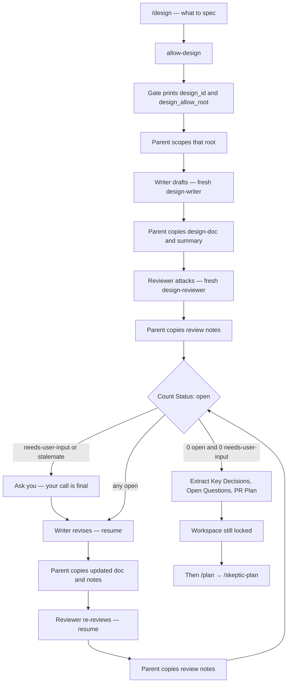
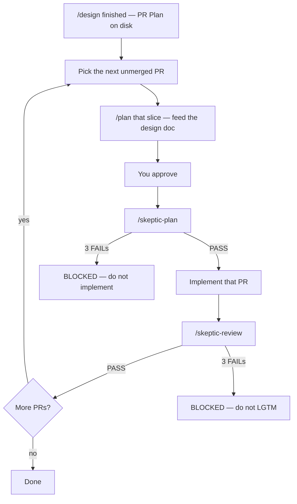
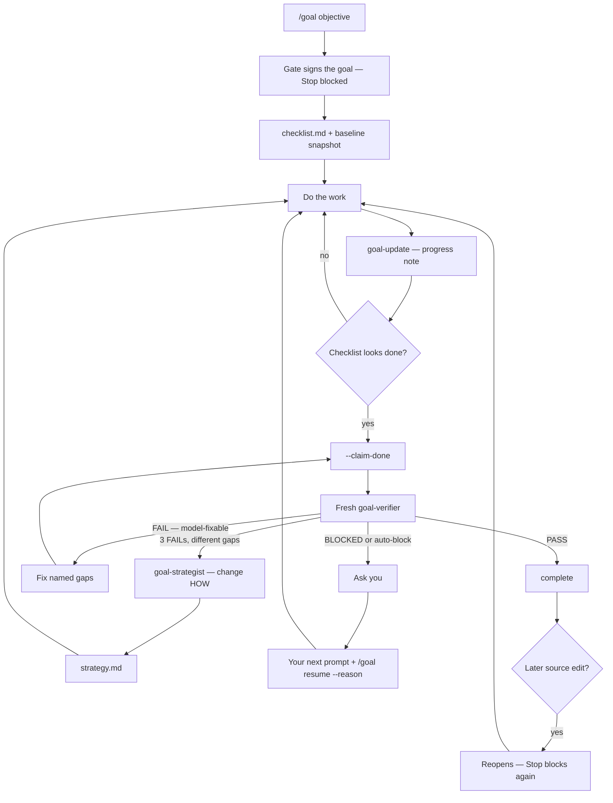

# How to use Devin Skills

This is the everyday guide. For why the lock exists and what it cannot do, see [how-it-works.md](how-it-works.md). For install flags, see [install.md](install.md).

You need Devin CLI and a completed `sh install.sh`. Confirm with `/hooks` — `devin-gates.py` should be listed.

## The default: locked

A new session cannot edit the workspace. That is on purpose.

- **Writes** (edit, write, apply_patch, most mutating exec, GitHub MCP that changes things) stay blocked until a **plan-skeptic** PASS exists.
- **Stop** ("I'm done") stays blocked until a **code-skeptic** PASS exists, unless nothing actually changed, you set a bypass, or the Stop-loop guard fires. An attached `active` [goal](#how-to-use-goal) blocks Stop regardless — even with zero mutations or in plan mode.

Approving `/plan` is not a skeptic PASS. You still need `/skeptic-plan` before implementation.

## Everyday workflow

Optional, before step 1, if the change needs a spec: **[/design](#how-to-use-design)**. Then take the first PR slice into `/plan`. Optional wrap around the whole job if "done" is a checkable condition: **[/goal](#how-to-use-goal)**.

### 1. Plan

```
/plan add a retry around the GitHub API client
```

Devin's built-in planner drafts a plan (read-only). Approve it when it looks right.

Do **not** name a skill `plan`. Do **not** start implementing yet — writes are still blocked.

### 2. Skeptic the plan

```
/skeptic-plan
```

The parent spawns a **fresh** `plan-skeptic` subagent. That persona is read-only. It tries to find holes: unverified assumptions, missing steps, wrong files, claims the codebase contradicts.

- **PASS** — the gate mints a plan-skeptic marker. Writes unlock.
- **FAIL** — you revise the plan and spawn another fresh skeptic. Cap is 3 FAIL sweeps, then **BLOCKED**.
- **BLOCKED** — do not implement. Fix the plan with the user, or `/gate-bypass` with a reason if you truly want to skip.

Check:

```
/gate-status
```

You want `plan-skeptic: present` before you let Devin edit.

### 3. Implement

Now Devin can write. Do the work. Commit if you want — `git add` / `git commit` are not treated as source mutations.

### 4. Skeptic the diff

When the change is ready, freeze it. Do not keep editing during the review.

```
/skeptic-review
```

This:

1. Gathers the full candidate (`git status`, `git diff HEAD`, plus commits since the merge base unless you named a range).
2. Optionally runs `finding-skeptic` over a first-pass finding list.
3. Always runs a fresh `code-skeptic` on the pasted diff.

On PASS, the gate mints a code-skeptic marker and Stop is allowed.

If you edit source **after** a PASS, the code marker is cleared. You need another `/skeptic-review`. A stale PASS cannot be reused.

## How to use /design

Use this when you'd write a spec by hand: a system design, a migration, a feature that needs Key Decisions. Do **not** use it for a typo, a one-file bugfix, or "just implement it." Those go to `/plan` or `/gate-bypass`.

`/design` writes a document. It does not edit your repo. It does not lift the write-lock.

### 1. Invoke it

In Devin:

```
/design <what to design>
```

The argument **is** the task. Include:

- What you want (feature, architecture, migration)
- Constraints ("no new infra", "keep the public API", "must ship behind a flag")
- Paths and systems that matter (`src/jobs/sync.ts`, the Job row, …)
- Links or prior conversation that the writer should not have to guess

Examples:

```
/design replace the sync job with a queue worker. Keep the existing Job row shape. No new message bus — use the DB as the queue.
```

```
/design add retry/backoff around src/github/client.ts. Same exported functions. Cap at 3 attempts. Document the idempotency assumption.
```

```
/design split billing into a separate package. Do not change the HTTP API in this design — PR Plan should land that later.
```

Bad: `/design make it better`. The writer will invent a problem.

### 2. Sit through the loop (interrupt only when asked)

You should see progress like:

- `Design document drafted. Starting review...`
- `Reviewer found N issues (X critical, Y major, Z minor/nit). Resuming writer to revise...`
- `Revisions applied. Running re-review...`
- `Re-review (round 2)...`
- `Review passed with 0 issues. Finalizing...`

You do **not** need to type `/design` again each round. The parent keeps going.

**When Devin asks you a question**, answer it. That happens when:

- the reviewer marked something `needs-user-input` (product call, not a tech nit), or
- writer and reviewer are stuck (`wontfix` re-opened twice)

Your answer is **final**. The writer incorporates it as `Status: addressed` and does not re-litigate it.

### 3. Take the artifacts

Files land under a gate-issued design root, usually:

```
~/.cache/devin-skills/design/<id>/
  design-doc.md    # the spec
  summary.md       # short writer's summary
  review.md        # review notes
  state.json       # round count, agent ids — ignore unless debugging
```

`<id>` is an 8-char hex id printed at the start (`design_id=...`). The parent also prints the full `design-doc.md` path in the final report.

The spec is required to contain:

- `## Key Decisions` — numbered architectural calls with rationale
- `## PR Plan` — last major section, `### PR N:` slices that are independently mergeable

Missing either is at least a major review finding. The loop should not finish without them.

### 4. Read the final report

When the loop exits you get:

1. Design document path
2. Key Decisions (extracted)
3. How many review rounds
4. Issues addressed, by severity
5. The PR Plan
6. Open questions, if any remain — those are asked, not silently filled in

Keep `design-doc.md`. That file is the input to `/plan`. Do not start implementing from this skill.

### 5. What this skill will not do

| Don't expect | Do this instead |
| --- | --- |
| Unlock workspace writes | `/skeptic-plan` after `/plan` |
| Edit `src/` | `/plan` a PR slice, then implement |
| Walk PR 1…N by itself | You run `/plan` per slice. `/goal` tracks one objective, not a PR list. |
| Survive a vague one-liner | Put constraints in the `/design` argument |
| Run inside a subagent | Invoke it on the parent (depth 0) only |

Re-running `/design` on the same problem starts a **new** design id (new folder). It does not resume the last spec unless you paste that spec into the new prompt.

This is a writer/reviewer loop, not an unlock. Workspace source stays locked. Artifacts go under the design root. The parent is the only writer — `design-writer` and `design-reviewer` are read-only. The parent copies their fenced markdown onto disk.



Rules that matter in practice:

- **Loop until zero open.** No max-rounds cap. Nits count.
- **Resume** the same writer/reviewer on revise and re-review. If resume fails, spawn fresh and paste the files — disk is the memory.
- **Escalate, don't spin.** A `wontfix` re-opened twice, or `needs-user-input`, goes to you. Your answer is final (`Status: addressed`).
- **`/design` does not lift the write-lock.** You still `/plan` → `/skeptic-plan` before implementing.

## From design to implementation

`/design` covers the **execution plan as a document**. It does not cover **running** that plan.

The writer is required to end the spec with `## PR Plan`, shaped so a later execute path can parse it:

```
## PR Plan

### PR 1: <title>
- **Files/components affected:** <paths>
- **Dependencies:** None
- **Description:** <brief description>

### PR 2: <title>
- **Files/components affected:** <paths>
- **Dependencies:** PR 1
- **Description:** <brief description>
```

Each PR must be independently reviewable and mergeable. Missing `## PR Plan` is at least a major review finding. Step 6 of `/design` extracts that section and presents it to you. Then the skill **stops**. Workspace source is still locked.

No Devin skill walks `PR 1 … PR N` on its own — `/goal` tracks a single verifiable objective, not a PR list. The honest execute path is Devin's built-in `/plan`, one slice at a time:

```
/plan implement PR 1 from the design doc at ~/.cache/devin-skills/design/<id>/design-doc.md
```

Paste or point at the spec so `/plan` does not invent a different design. Approve. Then the usual lock:

1. `/skeptic-plan` — skeptic the implementation plan for **this** slice
2. Implement
3. `/skeptic-review`
4. Next PR



Small change, one PR in the plan? One `/plan` through the whole spec is fine. Multi-PR design? Do not squash them into one implementation plan unless you explicitly want that — the skeptic will (correctly) complain if the slice is not independently mergeable.

Do **not** name a skill `plan`. Do **not** ask `/design` to start implementing. Do **not** `/gate-bypass` just to skip from spec to code unless the work is actually tiny.

## How to use /goal

Use this when the work has a **checkable done condition** that should outlive one turn. `/design` writes a spec. `/plan` plans a slice. `/goal` keeps Devin on **one** objective until an independent verifier agrees it is done.

Good:

```
/goal get the full test suite green
```

```
/goal GET /health returns 200 from the running server
```

```
/goal the billing migration is reversible on a copy of prod-shaped data
```

Bad: `/goal implement the whole PR Plan`. That is still `/plan` per slice. `/goal` tracks one objective, not a list of PRs. Also bad: `/goal make it better` — the verifier needs a concrete checklist.

`/goal` does **not** lift the write-lock. Code changes still need `/skeptic-plan` before edits and `/skeptic-review` before a code-level "I'm done." A research/liveness goal with no source mutations needs no skeptic markers.

### 1. Invoke it

```
/goal <objective>
/goal status
/goal pause --reason <why>
/goal resume --reason <why>
/goal clear --reason <why>
```

Anything that is not `status|pause|resume|clear` is a new objective. The workspace may only have **one** non-cleared goal. `complete` still occupies the slot until you `/goal clear`.

Optional shape (biases the verifier, not enforcement):

```
/goal --kind code-change get the unit tests in src/billing/ green
```

Kinds: `code-change` | `research` | `analysis` | `general` (default).

### 2. Sit through work → claim → verify

You should see: a `goal_id=`, a design-like cache root, then work, then a claim, then a verifier.



You do **not** type `/goal` again each round. The parent keeps going until PASS, auto-block, or you pause/clear.

**When Devin asks you**, that is a real stop:

- verifier `BLOCKED` (contradiction or unverifiable evidence — not model-fixable)
- auto-block: spinning on the same gaps, sweep cap, unclaimed work, infra errors, repeated external blocker
- Devin wants to `goal-pause` / `goal-clear` / `--blocked`

Resume of a `paused`/`blocked` goal needs **your next message**, then `/goal resume --reason …`. The model cannot self-resume across that boundary.

### 3. Take the artifacts

Usually:

```
~/.cache/devin-skills/goal/<id>/
  checklist.md    # per-item done contract
  evidence/       # tests, diffs, transcripts — verifier is read-only
  strategy.md     # only after a whack-a-mole fire
  state.json      # parent scratch
```

`<id>` is 8 hex chars from `goal_id=`. Checklist items must be concrete ("`pytest tests/billing` exits 0", not "tests look good"). The verifier judges items, not vibes.

### 4. What the gate owns (you cannot reset this)

Devin cannot mark the goal complete. `--claim-done` is a **claim**, bound to the current tree. A later edit stales it; re-claim after every fix. Only a **fresh** `goal-verifier` (`resume` unset) emitting `GATES_VERDICT: PASS` mints `complete`.

The gate also decides when to **stop looping**. Auto-blocks set `status=blocked` with a prefixed reason (`/goal status` shows them):

| Prefix | Trigger | Meaning |
| --- | --- | --- |
| `no-progress:` | Same gaps on 2 consecutive FAIL sweeps (5 after a strategist grant) | Spinning |
| `sweep-cap:` | Verifier sweeps hit the cap (default 6, +2 per strategist fire, max +4) | Bound exhausted |
| `blocking:` | Verifier `BLOCKED` — every residual is contradiction/unverifiable | You have to decide |
| `external-repeat:` | Same `blocker_key` again | Repeated external dependency |
| `unclaimed-work:` | Working without claiming (default 40 rounds) | Claim, pause, or block |
| `infra-errors:` | Consecutive failed `run_subagent` / MCP / `write_to_process` (default 3) | Real outage |

**Whack-a-mole.** After 3 consecutive FAIL sweeps with *different* gap sets, a `goal-strategist` fires. Claims are refused until `strategy.md` exists. Objective and checklist stay frozen — change the HOW, not the WHAT.

**Self-block is a streak.** `--blocked --reason` is refused twice ("keep working"); the third is honored. Add `--blocker-key snake_key` for an external cause so a repeat escalates.

### 5. Pause / resume / clear

| You type | What happens |
| --- | --- |
| `/goal status` | Attachment, sweeps, stall, blocked reason. Any session. |
| `/goal pause --reason …` | Releases the Stop block at the next hook boundary. Goal stays on disk. |
| `/goal resume` | New session adopting an already-`active` goal. No reason. |
| `/goal resume --reason …` | From `paused`/`blocked`, after **your** next prompt. Resets stall counters. |
| `/goal clear --reason …` | Tombstones the goal. Late verifier results are ignored. |

`goal-pause` cannot interrupt a running tool call. It lands at the next hook.

### 6. What this skill will not do

| Don't expect | Do this instead |
| --- | --- |
| Unlock workspace writes | `/skeptic-plan` after `/plan` |
| Walk PR 1…N | `/plan` each slice from the design doc |
| Mark itself complete | Fresh `goal-verifier` PASS only |
| Keep going while you are away | No host round driver. Stop-block only keeps an in-flight turn alive |
| A token budget | Sweep cap is the bound |
| Mid-turn pause | Pause lands at the next hook boundary |
| Survive a vague one-liner | Put a checkable condition in the `/goal` argument |

A later source mutation after `complete` **reopens** the goal and re-blocks Stop. That is on purpose: the witness was bound to the tree it verified.

Honest gaps (no host rounds, no token budget, parent still pastes the evidence bundle): [how-it-works.md](how-it-works.md#what-we-did-not-copy).

## Commands at a glance

| You type | What happens |
| --- | --- |
| `/plan …` | Built-in read-only draft. Approve in Devin's UI. |
| `/design …` | Spec: writer/reviewer loop. See [How to use /design](#how-to-use-design). |
| `/goal …` | Gate-tracked objective. Stop blocks until a fresh `goal-verifier` PASSes. `status`/`pause`/`resume`/`clear`. See [How to use /goal](#how-to-use-goal). |
| `/skeptic-plan` | Attacks the plan. Lifts the write-lock on PASS. |
| `/skeptic-review` | Attacks the frozen diff. Lifts the Stop-lock on PASS. |
| `/skeptic-review main...HEAD` | Same, but use this git range. |
| `/gate-bypass <reason>` | Unlock this session. Reason required. Audited. |
| `/gate-status` | Print markers, sweeps, override, `source_seq`, attached goal. |

## Small tasks

Not every change deserves a skeptic gauntlet. For a typo, a comment, or "I just need to run the tests first":

```
/gate-bypass one-line typo in README
```

Rules:

- A reason is required. The skill will refuse an empty one.
- It lasts **this session only**.
- It is **not** Devin's built-in `/bypass` / `/yolo` / `/dangerous`. Those change permission mode. This one is the gate's honest skip.

To turn the lock off for a whole Devin process:

```sh
DEVIN_GATES_OFF=1 devin
```

That env var must be in the **shell that starts Devin**. Devin setting `DEVIN_GATES_OFF` on a tool call does not count.

## What stays allowed while locked

The lock is not "no tools." Read, grep, and similar stay available. Plan files under `~/.devin/plans/` can be edited so `/skeptic-plan` can revise. Design artifacts can be written under the design root `/design` created. Git status/diff still work.

`/goal` management also stays available while locked: the goal CLI subcommands (`set-goal`, `goal-update`, `goal-pause`, `goal-resume`, `goal-clear`, `goal-status`, `goal-baseline`) are allowlisted on `exec`, and the attached session can write under the goal's `goal_allow_root` (checklist, evidence, `strategy.md`) — those paths live outside the workspace, so they never reopen the goal.

What is blocked: workspace source writes, general-purpose subagents, and mutating MCP (create issue, push, …) until the plan marker exists.

## FAQ

**When do I `/design` vs `/plan`?**
`/design` is a spec (architecture, Key Decisions, PR Plan). `/plan` is the implementation plan for a slice of work. Spec first when you'd write a design doc by hand; skip `/design` for small, obvious changes.

**When do I `/goal` vs `/plan` vs `/design`?**
`/design` is a spec. `/plan` is the implementation plan for a slice. `/goal` is a durable, checkable objective the gate will not let Devin walk away from until a verifier PASSes. Use `/goal` when "done" is a condition ("tests green"), not a file list.

**Does `/goal` unlock writes or implement the PR Plan?**
No and no. Writes still need `/skeptic-plan`. PR slices still need `/plan`. `/goal` only owns the *completion* claim.

**Does `/design` implement the PR Plan?**
No. It writes and presents the plan. You (or a later turn) run `/plan` on a slice, then `/skeptic-plan`. See [From design to implementation](#from-design-to-implementation).

**Devin still cannot write after I approved `/plan`.**
That is correct. Approval is not a skeptic. Run `/skeptic-plan`.

**`/skeptic-review` says to run `/skeptic-plan` first.**
The Stop-lock requires a plan marker. Order is plan skeptic, then implement, then code skeptic.

**I forged a marker file. Still locked.**
Markers are HMAC-signed with a secret the agent cannot write. Only the gate script mints them.

**I want to ship a plugin to a teammate.**
`devin plugins install --local ./plugin` shares skills. It does **not** install the lock. They still need `install.sh`.

**Can I install per-repo instead of user-wide?**

```sh
sh install.sh --project
```

That writes `.devin/hooks.v1.json` in the current directory. User-level remains the default so every repo is locked.

**How do I see what the gate thinks?**

```
/gate-status
```

Or:

```sh
python3 ~/.config/devin/hooks/devin-gates.py status
```
